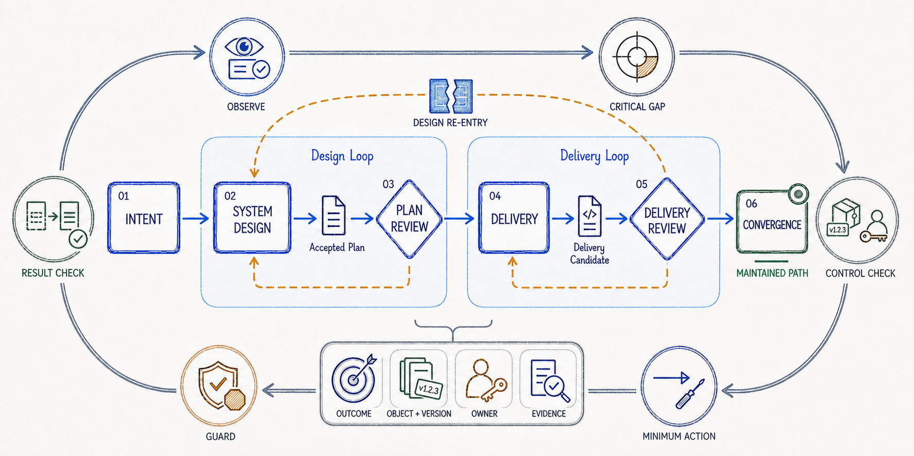

# Proofloop

> 让系统变更从意图出发，以精确对象为边界，以可验证证据闭环。



*图 1：系统变更的控制、评审与收敛机制。外环依次表达接纳观察、定位关键缺口、确认对象与 Owner、选择最小动作、通过 Guard、比较结果并重新进入控制；内层由设计与交付两个专业闭环形成、评审和收敛精确候选。*

Proofloop 是一组面向 Codex 的系统级工程 Skills。它们不追求增加流程，而是解决复杂变更中最容易断裂的关系：用户真正要的结果、当前系统事实、被采纳的设计、实际实现候选、独立专业判断，以及最终可以证明的结果。

每个 Skill 都承担一个清晰且可独立使用的专业职责；只有当系统级变更需要跨多个专业边界持续保持一致时，才由 `plan-to-delivery` 建立控制闭环。

## 设计意图

| 原则 | 设计意图 |
| --- | --- |
| 结果先于机制 | 先确认用户、消费者或责任方必须能够依赖的结果，再决定状态、抽象、兼容、恢复或基础设施。局部技术完成不能替代最终结果。 |
| 判断基于事实 | 设计和评审必须绑定真实代码、合同、运行证据、实际消费者与责任边界；提案、惯例和当前实现都只是证据，不是权威答案。 |
| 专业职责隔离 | 设计、方案评审、实施、交付验收和清理由对应 Owner 承担。Controller 可以理解和质疑技术内容，但不代替专业 Worker 创作产物或签发结论。 |
| 最小完整变化 | 优先复用、直接修改、删除和明确责任，只引入完成既定结果所必需的结构，并同时闭合运行、失败、迁移和退出语义。 |
| 精确对象与证据 | 设计结论、实现验收和完成判断都绑定明确版本与证据范围；对象变化只使受影响的结论失效，不用状态词或流程完成度代替证明。 |

## 工作机制

设计、评审、实施、验收和清理是常见责任关系，不是必须依次执行的固定流水线。单项设计、评审、验收或清理应直接调用对应 Skill。`plan-to-delivery` 只在需要持续对齐设计、实现、专业判断和结果证据时进入，并通过可恢复检查点维护当前事实、关键缺口、Owner、活动动作和下一候选动作。

## Skills

| Skill | 设计意图 | 关键机制 |
| --- | --- | --- |
| [`plan-to-delivery`](skills/plan-to-delivery/SKILL.md) | 把系统交付建模为围绕结果和证据不断收敛的控制闭环，而不是固定阶段状态机。 | 维护原始结果与授权、权威对象及版本、闭合责任方、证据与未闭合条件；每轮接纳观察、定位关键缺口、确认对象可控、选择最小动作并通过 Guard。 |
| [`system-overview-design`](skills/system-overview-design/SKILL.md) | 设计首先是一项系统判断，其次才是文档表达；目标是形成有证据支持的最小完整设计，而不是补齐模板或堆叠架构元素。 | 从可观察结果和真实约束建立问题，比较可行路线与最强简单替代，明确责任、合同、状态、失败和演进语义，再用关键场景挑战并收敛设计。 |
| [`plan-review`](skills/plan-review/SKILL.md) | 评审设计路线本身，而不是润色方案文档或提前验收代码。 | 独立重建评审依据，检查当前系统模型、能力选择、责任与权威、合同与状态、失败语义、长期结构和迁移可执行性，并区分已成立缺陷、决策性未知和用户选择。 |
| [`delivery-review`](skills/delivery-review/SKILL.md) | 验收精确交付候选，而不是根据 diff 大小、测试数量或实现者声明判断完成。 | 分别重建“要求交付什么”和“实际交付什么”，从真实消费者、合同和运行路径推导失败模式，用聚焦证据判断缺失、错误、越界、实现缺陷、迁移风险和证据缺口。 |
| [`code-cleanup`](skills/code-cleanup/SKILL.md) | 清理的目标是让已确认结果收敛为唯一、可维护的实现，而不是进行风格优化或无边界重构。 | 重建受影响的关键执行路径，对每个机制做必要性判断，优先删除和复用，关闭旧入口、旧路径及其再生产机制，并从行为保持、旧路径退出和净简化三个维度证明结果。 |

## 什么时候使用

- 需要创建或重写系统级设计：`$system-overview-design`
- 准备按某个技术方案实施，需要先判断路线是否成立：`$plan-review`
- 已有补丁、分支、提交、PR 或迁移候选，需要独立验收：`$delivery-review`
- 目标已经确认，需要删除重复、过时或无依据的实现：`$code-cleanup`
- 一个系统级目标需要跨设计、实施、验收和清理持续控制：显式调用 `$plan-to-delivery`

## 安装

使用 [Agent Skills CLI](https://github.com/vercel-labs/skills)，需要 Node.js 18 或更高版本。

查看仓库中的 Skills：

```sh
npx skills add lvjg/skills --list
```

将全部 Skills 全局安装给 Codex：

```sh
npx skills add lvjg/skills --skill '*' --global --agent codex --yes
```

只安装一个 Skill：

```sh
npx skills add lvjg/skills --skill plan-review --global --agent codex --yes
```

如需项目级安装，去掉 `--global`。

## 更新

```sh
npx skills update --global --yes
```

## 全局工程原则

[`codex/AGENTS.md`](codex/AGENTS.md) 是独立的 Codex 全局工程原则模板，不是 Skill，也不会由 Agent Skills CLI 安装。使用前应先审阅其内容，再决定是否作为全局 `AGENTS.md`。
